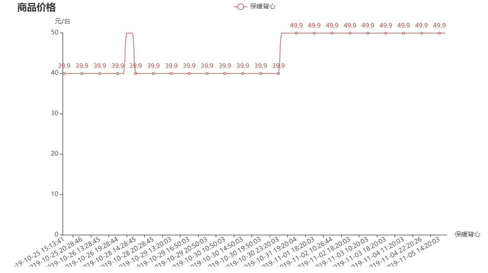
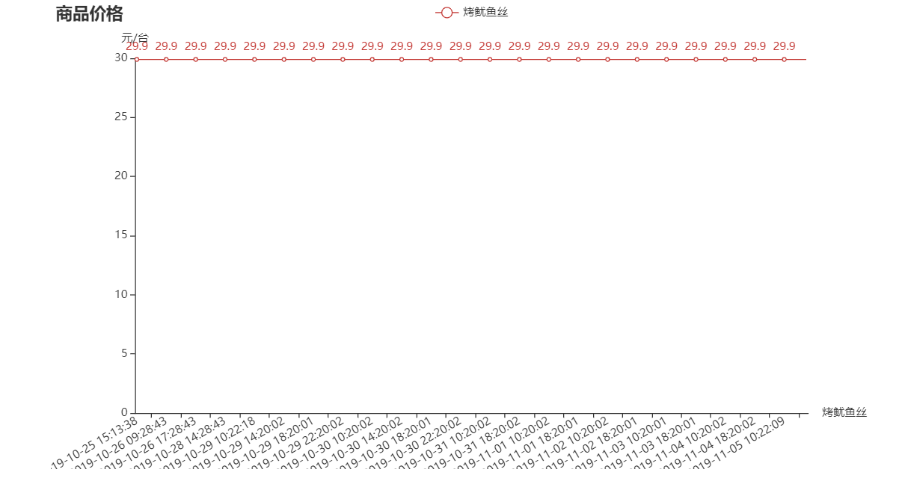
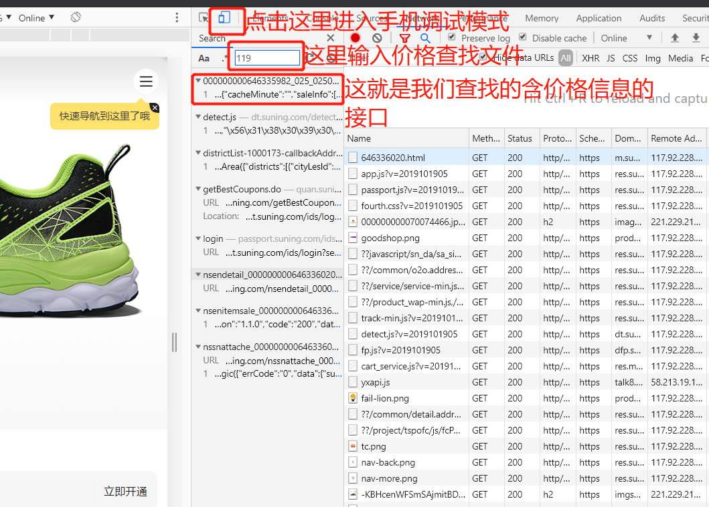

# 商品价格监控
## 实现功能
* 输入天猫、苏宁、京东、拼多多（网页页面 <http://yangkeduo.com/>）任一商品链接，不是口令。**请复制选择好商品配置的页面链接**，即返回相应商品价格，并保存到文件。商品页面若有团购与单独购买两个价格，返回团购价格。
* 使用 Windows 任务计划或 Linux 定时任务，定时执行程序。获取不同时段的商品价格信息。
* 单独运行画图程序，可根据定时任务获取的数据，生成商品价格时间变化折线图。
* 程序监测的两件商品图，<https://htmlpreview.github.io/?https://raw.githubusercontent.com/spiderbeg/price_monitor/master/pic/2.html> 和 <https://htmlpreview.github.io/?https://raw.githubusercontent.com/spiderbeg/price_monitor/master/pic/3.html>。注意：点击后请等待一段时间即可，请勿频繁刷新。
     *  
     *  
* 简单的商品查看页面 <https://htmlpreview.github.io/?https://raw.githubusercontent.com/spiderbeg/price_monitor/master/search/search.html> 。注意：点击后请等待一段时间即可，请勿频繁刷新。
## 快速上手
### 项目下载
* 确认本地放置项目的目录，运行：
          
          git clone https://github.com/spiderbeg/price_monitor.git
### 大致流程
1. 在 goods.txt 中输入需要查询的商品链接，注意 **\",\" 请输入英文字符**，参数名如下：
      * 图像名：运行画图程序后，生成的文件名，图像名相同则数据在同一图像文件中出现。
      * 商品名：监测的商品的名字，也是图像上的标题。
      * 商品链接：商品详细页链接。
2. 使用 Windows 任务计划或 Linux 定时任务，定时执行程序 **timing.py**。
3. 获取到数据后，运行 **draw.py** 即会在 **pic文件夹** 中生成含有商品价格时间变化折线图。
## 定时任务详解
### Windows 任务计划
* 推荐阅读 <https://mp.weixin.qq.com/s/JKFvnmtlEqaE8GxbX6Fpyw>
* 注意如果你的 Python 使用的是虚拟环境，那么请找到你虚拟环境的 pythonw.exe (注意这里 python.exe 与 pythonw.exe 都可以使用，使用 pythonw.exe 是为了避免控制台一闪而逝的现象，不必纠结).
* 如果你用的是 anaconda 或者 python 的虚拟环境，那么就需要进入虚拟环境中，再运行程序。这里以 anaconda 虚拟环境为例。
    * 首先找到安装 anaconda 的安装目录，在安装目录中找到 **condabin文件夹中的 conda.bat**，在上面推荐阅读教程中**程序或脚本** 输入框最前面添加 conda.bat 的路径和 **activate** 你的虚拟环境的名字。如： 
    
          your_anaconda_setup_path\condabin\conda.bat activate your_env_name & your_anaconda_setup_path\envs\your_env_name\pythonw.exe your_program_file_path\timing.py
### Linux crontab 定时任务
* 推荐阅读 <https://linuxtools-rst.readthedocs.io/zh_CN/latest/tool/crontab.html>，在服务器上运行，输入天猫和拼多多链接，成功率可能比较低。
* 两个执行示例

      15 8 * * * myCommand # 每天上午8点15分执行
      15 8-23 * * * myCommand # 每天8点到晚上23点，每个小时第15分钟执行 
## 运行环境
* python3.7
* Windows
* jupyter notebook
## 运行依赖包
* requests
* pyecharts
* beautifulsoup4
## 项目思路
### 部分问题回答
* 项目的大致思路流程：第一步：使用**商品详细页链接**获取商品信息与商品**价格**，并保存获取数据 **时间、商品介绍，价格** 到 csv 文件中；第二步：使用定时任务**定时执行**第一步完成的程序；第三步：读取前两步获取到的时间、商品介绍、价格数据。使用 **pyecharts** 绘制绘制商品价格时间变化折线图。
* 为什么不使用 pc 端来调试网页，获取价格信息？ 因为在未登录状态天猫的详细商品页的信息是虚假的，同时从移动端网页入手，可以降低调试难度。
* 谷歌浏览器如何开启手机调试模式？ F12 进入开发者模式，然后鼠标点击一下，具体见下图,包括后文的查找价格接口信息。
 
### 商品详细页源代码中获取价格
* 这里以链接商品 <https://item.m.jd.com/product/100009082500.html> 介绍过程。相关代码位于 **shop** 文件夹下 **jd.py** 中。 在谷歌浏览器手机调试模式下输入链接。然后输入页面价格查找价格文件所处位置。发现价格在原网页中。那么接下来就是，使用提取价格信息了。代码如下：

      import requests
      from bs4 import BeautifulSoup

      r = requests.get('https://item.m.jd.com/product/100009082500.html')
      soup = BeautifulSoup(r.text, features="lxml")
      result = soup.find(class_="price large_size")
      price = result.text.strip().replace('¥','') # 获取价格
        
### 从接口获取商品信息
* 示例链接 <https://m.suning.com/product/0070074466/646336020.html>. 相关代码位于 **shop** 文件夹下 **sn.py** 中。重复上一步操作，发现源网页代码中不存在价格信息，那么就接着找其它请求中的信息。找到后发现商品价格信息在一个请求的返回信息中 <https://pas.suning.com/nsenitemsale_0000000646336020_0070074466_5_999_100_025_0250199______1000173_.html?_=1571284185922&callback=wapData>，那接下来就是获取数据了。

      import requests
      import json
      
      # url = 'https://m.suning.com/product/0070074466/646336020.html' 商品详细页，里面的两个id是我们所需要的。
      # 我们发现的数据接口
      url = 'https://pas.suning.com/nsenitemsale_0000000646336020_0070074466_5_999_100_025_0250199______1000173_.html?_=1571284185922&callback=wapData'
      r = requests.get(url)
      result = r.text.strip()[8:-1]
      result = json.loads(result)
      price = result['data']['price']['saleInfo'][0]['promotionPrice']
## 主要文件说明
### shop 文件夹
* info 部分类别商品的测试记录。
* jd.py 京东商品链接的处理程序。实现功能：输入京东商品链接，输出当前商品价格。
* tm.py 天猫商品链接处理程序。功能：在商品详细页显示商品已选的条件下。输入商品链接，获取天猫商品价格 。
* sn.py 苏宁商品链接的处理程序。功能：在商品详细页显示商品已选的条件下。输入商品链接，获取苏宁易购商品价格 。
* pdd.py 拼多多商品链接的处理程序。功能：输入平多多商品链接，返回价格。
### test.py
* 测试商品链接是否能够成功获取到商品价格。
### timing.py
* 进行定时抓取任务时，运行的文件。
### data 文件夹
* 商品价格信息获取后储存位置。
### pic 文件夹
* 运行 draw.py 后，图像文件生成在 pic 文件中。

